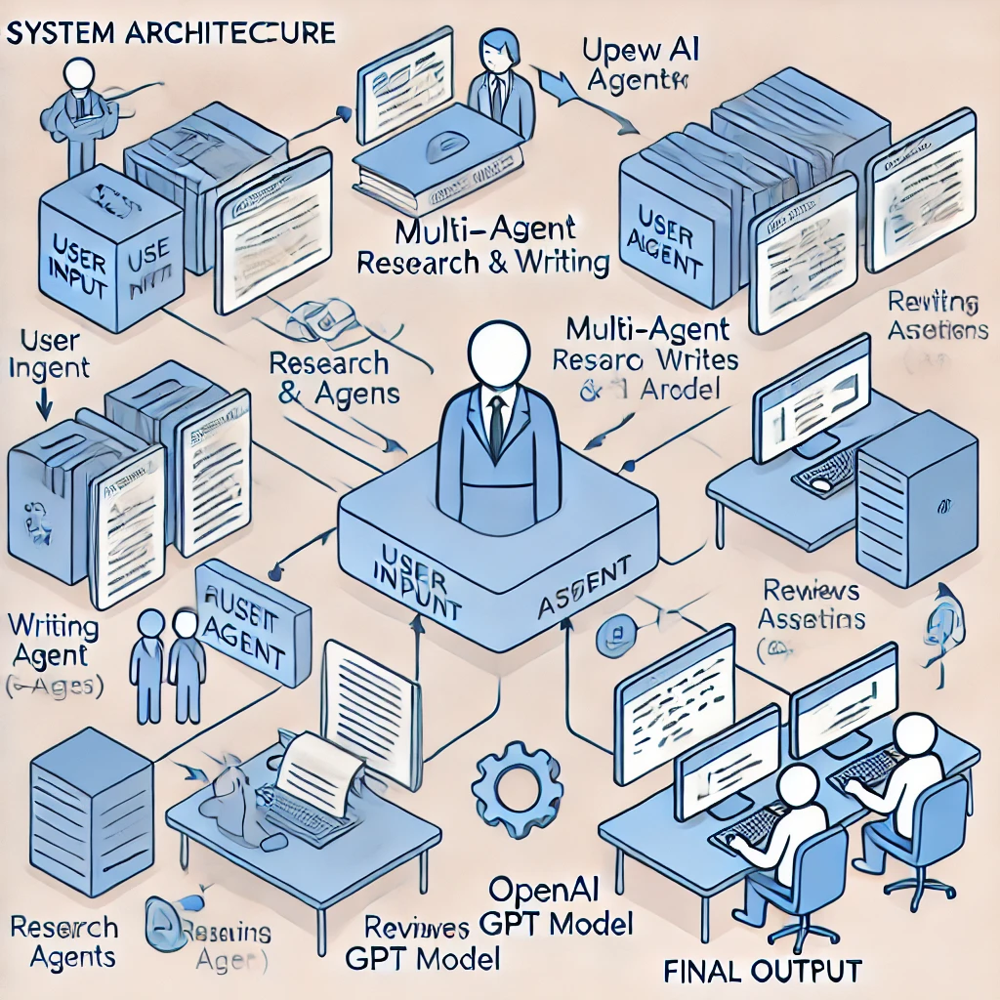

# Research and Development Agent Using CrewAI

## Overview
This project demonstrates the use of CrewAI to build a multi-agent system that can research and generate a structured article. The system utilizes OpenAI's `gpt-3.5-turbo` to process tasks assigned to AI agents.

## Architecture Diagram
Below is the system architecture illustrating how the agents collaborate to complete a research workflow:



## Features
- **Multi-Agent Collaboration**: Uses CrewAI to assign specific tasks to agents.
- **Automated Research & Writing**: AI agents work together to gather data, write content, and review the final output.
- **OpenAI Integration**: Utilizes GPT-3.5 for text generation and processing.
- **Dynamic Task Management**: Assigns and executes tasks efficiently.

## How It Works
1. **User Input**: A user provides a research topic.
2. **Agents**:
   - **Research Agent**: Gathers relevant information.
   - **Writing Agent**: Composes a well-structured article.
   - **Reviewer Agent**: Proofreads and improves the final output.
3. **CrewAI Framework**: Manages agent interactions and ensures workflow execution.
4. **OpenAI GPT Model**: Generates text based on research.
5. **Final Output**: A polished research article.

## Installation
To set up and run this project, follow these steps:

1. Clone the repository:
   ```bash
   git clone https://github.com/ahmad786writes/Research-and-Development-Agent.git
   cd Research-and-Development-Agent
   ```

2. Install dependencies:
   ```bash
   pip install -r requirements.txt
   ```

3. Run the research Notebook

## Contributing
Feel free to open an issue or submit a pull request for improvements.

## License
This project is licensed under the MIT License.
